**Compte rendu**

******  
*Introduction :*  
Ce programme a pour objectif de permettre la gestion et l'affichage de notes d'étudiants. Il s'agit d'un ensemble de fonctions qui répond à plusieurs objectifs spécifiques :  
*Saisie des notes* : L'utilisateur peut entrer une série de notes qui seront stockées dans un tableau.  
*Tri des notes* :  Les notes saisies sont ensuite triées en ordre croissant afin de faciliter leur analyse.  
*Affichage des notes* : Une fois triées, les notes sont affichées à l'écran pour que l'utilisateur puisse les consulter.  
*Affichage de la note maximale et minimale* : Le programme calcule et affiche les valeurs extrêmes (la plus haute et la plus basse note).  
*Calcul de la moyenne* : Enfin, une fonction calcule et affiche la moyenne des notes saisies.  
Ces opérations sont réparties en différentes fonctions afin de rendre le code plus clair, modulaire et réutilisable. 

*Toutes ces fonctions sont ensuite réunies et appelées dans une fonction principale, qui orchestre l'exécution globale du programme. Cela permet de traiter chaque étape de manière distincte tout en les regroupant dans un processus cohérent.*

**Fonction : saisieNotes**

*Description :*  
Cette fonction permet de saisir les valeurs d'un tableau de nombres flottants (float\[\]) à partir de l'entrée utilisateur via la console.

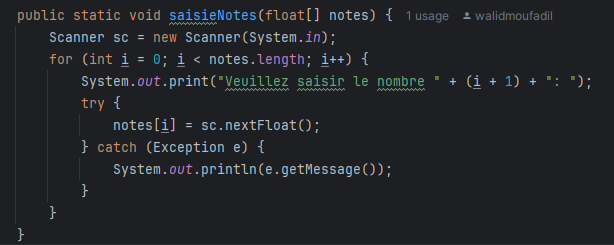

*Détails :*  
La fonction demande à l'utilisateur de saisir une série de valeurs pour remplir le tableau de notes. Elle utilise un objet Scanner pour lire les entrées de l'utilisateur. La boucle for parcourt chaque indice du tableau, affiche un message invitant l'utilisateur à entrer une valeur, puis lit et stocke la valeur saisie dans l'élément correspondant du tableau.

*Remarque :*  
La fonction modifie directement le tableau passé en paramètre, en remplissant ses éléments avec les valeurs saisies par l'utilisateur. Elle ne retourne aucune valeur.

**Fonction : afficherNotes**

*Description :*  
Cette fonction permet d'afficher les éléments d'un tableau de nombres à virgule flottante (type float\[\]) ligne par ligne dans la console.

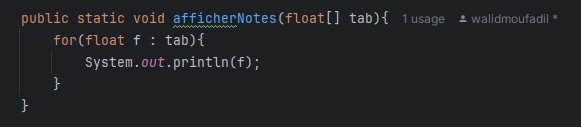

*Détails :*  
La fonction parcourt chaque élément du tableau tab en utilisant une boucle for-each et affiche chaque élément à l'aide de System.out.println(f), où f représente un élément du tableau.

*Remarque :*  
Cette fonction ne retourne rien. Elle se contente d'afficher les éléments du tableau dans la console.

**Fonction : trier**

*Description :*  
Cette fonction permet de trier un tableau de nombres à virgule flottante (type float\[\]) en ordre croissant.

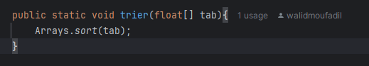

*Détails :*  
La fonction utilise la méthode Arrays.sort(tab) de la classe Arrays pour trier les éléments du tableau en ordre croissant. Cette méthode applique un algorithme de tri optimisé.

**Fonction : noteMax**

Cette fonction permet de chercher dans un tableau de nombre à virgule flottante la valeur maximale(note maximale).

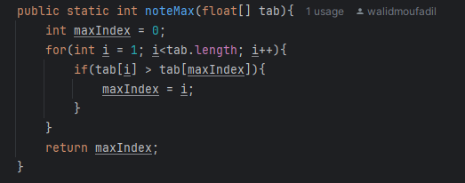

*Détails :*  
La fonction noteMax itère dans le tableau des notes pour trouver la valeur maximale qui retourne son indice.  
*Remarque :*  
On a choisi de retourner l'indice et non pas la valeur pour avoir plus de contrôle sur cette valeur.

**Fonction : noteMin**  
La fonction noteMin permet de chercher la valeur minimale (note minimale) dans un tableau de nombre à virgule flottante.

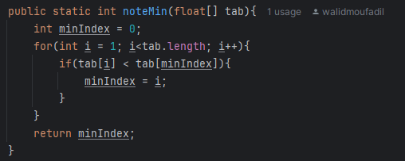

*Détails :*  
Cette fonction prend en paramètre un tableau dans lequel elle permet d’itéré pour trouver la valeur minimale et retourner son indice.  
*Remarque*:  
On a choisi de retourner l'indice et non pas la valeur pour avoir plus de contrôle sur cette valeur.

**Fonction : moyenne**  
La fonction moyenne permet de trouver une moyenne par rapport à l'ensemble des éléments qui se trouve dans le tableau de nombre à virgule flottante.

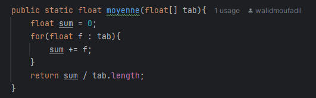

*Détails :*  
Cette fonction prend un tableau en paramètre qui  itère dessus pour appliquez la somme et retourner en dernier la moyenne.

*Remarque:*  
On a choisi de retourner la moyenne et non pas de l'afficher pour pouvoir l'utiliser ailleurs (dans la fonction principale).

**Fonction : nbElements**  
La fonction nbElements permet de calculer les répétitions d'une valeur, saisie (ou entrer) par l'utilisateur, dans un tableau de nombre à virgule flottante.

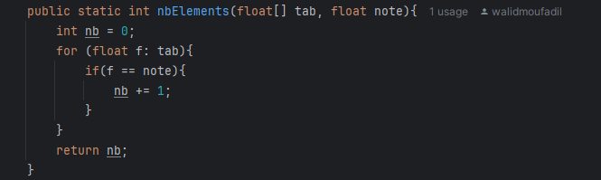

*Détails :*  
Cette fonction prend comme paramètres un tableau et une note qu'on va chercher en itérant dans le tableau entré en premier paramètre. La fonction retourne le nombre de répétitions de cette valeur dans le tableau.

**Fonction Principale : main**  
La fonction main permet l'exécution des fonctions citées ci-dessus et suivre l'enchaînement de ces derniers.

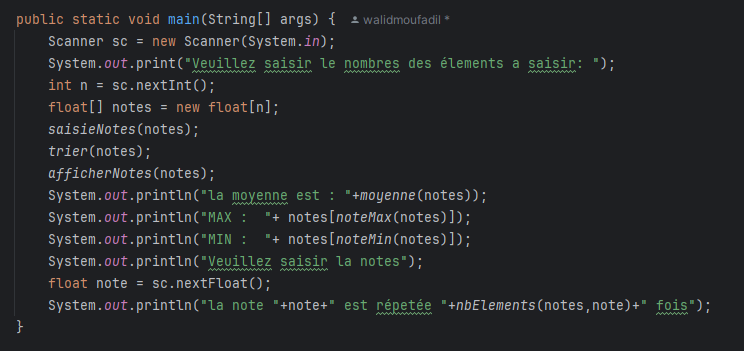

*Exécution* :  
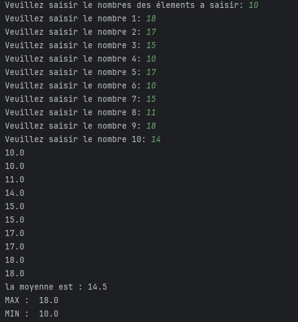
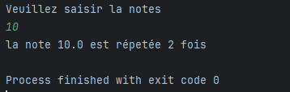

***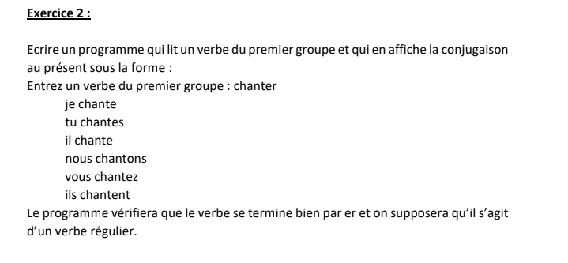***  
*Introduction* :  
Ce programme a pour objectif de permettre la conjugaison automatique de verbes du premier groupe en français. Il est composé de plusieurs fonctions qui répondent à des objectifs spécifiques :  
Saisie d'un verbe : L'utilisateur est invité à entrer un verbe du premier groupe (un verbe se terminant par "er").  
Vérification du verbe : Le programme vérifie si le verbe saisi est bien un verbe du premier groupe en s'assurant qu'il se termine par "er".  
Conjugaison du verbe : Si le verbe est valide, il est conjugué au présent de l'indicatif pour les différents pronoms personnels (Je, Tu, Il/Elle/On, Nous, Vous, Ils/Elles).  
Ces opérations sont implémentées dans différentes fonctions, ce qui rend le code modulaire et facile à comprendre. La fonction principale main orchestre l'ensemble des étapes, assurant que le verbe est d'abord validé avant d'être conjugué et affiché. Ce découpage permet de traiter chaque partie du processus de manière distincte, tout en assurant une exécution cohérente et fluide du programme.

**Fonction : saisieVerbe()**

*Description* : Cette fonction permet de capturer la saisie d'un verbe par l'utilisateur.

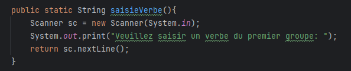

*Détails :*  
Elle utilise un Scanner pour lire l'entrée de l'utilisateur à partir de la console.  
Elle affiche un message à l'utilisateur pour lui demander de saisir un verbe du premier groupe.  
Elle retourne la chaîne de caractères saisie (le verbe).

**Fonction: verifierverbe(String verbe)**

*Description* : Cette fonction vérifie si le verbe saisi est bien un verbe du premier groupe, c'est-à-dire qu'il se termine par "er".

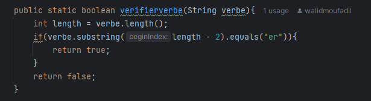

*Détails* :   
Elle récupère la longueur du verbe avec verbe.length().  
Elle utilise substring() pour extraire les deux dernières lettres du verbe et vérifier si elles correspondent à "er".  
Si le verbe se termine par "er", elle retourne true, sinon elle retourne false.

**Fonction: conjuguer(String verbe)**

*Description* : Cette fonction conjugue le verbe donné au présent de l'indicatif pour les six pronoms personnels (Je, Tu, Il/Elle/On, Nous, Vous, Ils/Elles).

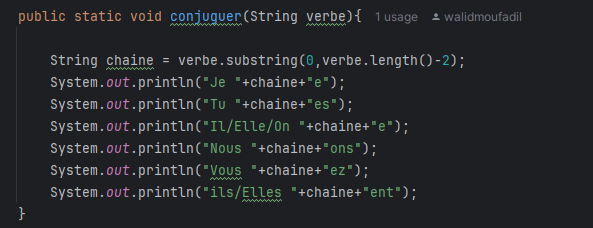

*Détails* :  
Elle supprime les deux dernières lettres "er" du verbe pour récupérer le radical avec verbe.substring(0, verbe.length()-2).  
Elle concatène ce radical avec les terminaisons correctes pour chaque pronom personnel :  
"Je" : radical \+ "e"  
"Tu" : radical \+ "es"  
"Il/Elle/On" : radical \+ "e"  
"Nous" : radical \+ "ons"  
"Vous" : radical \+ "ez"  
"Ils/Elles" : radical \+ "ent"  
Elle affiche ensuite la conjugaison pour chaque pronom avec System.out.println().

**Fonction Principale: main(String\[\] args)**

*Description* : C'est la méthode principale qui exécute le programme. Elle demande à l'utilisateur de saisir un verbe du premier groupe (terminant par "er"), vérifie que c'est bien un verbe du premier groupe, et le conjugue si c'est le cas.

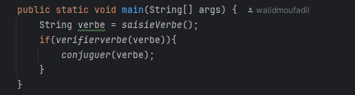

*Détails* :   
Elle appelle la fonction saisieVerbe() pour capturer la saisie de l'utilisateur.  
Ensuite, elle utilise la méthode verifierverbe() pour vérifier que le verbe saisi est bien du premier groupe (se terminant par "er").  
Si la vérification est positive, elle appelle la méthode conjuguer() pour afficher la conjugaison du verbe saisi.

*Exécution* :

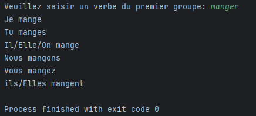

***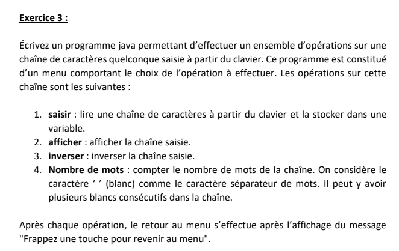***

***Introduction** :*

Ce programme a pour objectif de gérer des opérations diverses sur des chaînes de caractères saisies par l'utilisateur. Il permet d'interagir avec l'utilisateur via un menu et offre plusieurs fonctionnalités autour de la manipulation de chaînes, comme l'affichage, l'inversion, et le comptage des mots dans la chaîne. Il est conçu de manière modulaire, chaque fonctionnalité étant implémentée dans une fonction distincte, ce qui rend le code clair et maintenable. Les principales fonctionnalités sont :  
Saisie d'une chaîne de caractères : L'utilisateur peut saisir une chaîne qui sera ensuite utilisée pour d'autres opérations.  
Affichage de la chaîne : Une fois la chaîne saisie, elle peut être affichée en utilisant cette option.  
Inversion de la chaîne : Le programme permet d'inverser la chaîne et d'afficher le résultat.  
Comptage des mots : Le programme peut également compter et afficher le nombre de mots dans la chaîne saisie.  
Ces opérations sont organisées autour d'un menu qui permet à l'utilisateur de choisir l'opération qu'il souhaite exécuter. La gestion de l'interaction utilisateur est fluide, et le programme revient toujours au menu après chaque opération jusqu'à ce que l'utilisateur décide de quitter.

**Fonction: afficherMenu()**

*Description* : Cette fonction affiche le menu des options disponibles pour l'utilisateur.

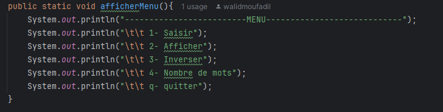

*Détails :*  
Elle affiche un menu structuré, présentant les différentes opérations que l'utilisateur peut effectuer : saisir une chaîne, l'afficher, l'inverser, compter le nombre de mots, ou quitter le programme.

**Fonction : saisie()**

*Description* : Cette fonction permet à l'utilisateur de saisir une chaîne de caractères.

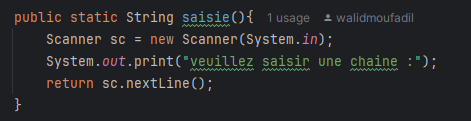

*Détails* :  
Elle utilise un Scanner pour capturer la chaîne saisie par l'utilisateur.  
Elle retourne cette chaîne pour être utilisée dans d'autres parties du programme.

**Fonction: afficheChaine(String chaine)**

*Description* : Cette fonction affiche simplement la chaîne de caractères actuellement stockée.

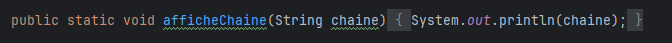

*Détails* :  
Elle prend la chaîne comme paramètre et l'affiche avec System.out.println().

**Fonction: inverserChaine(String chaine)**

*Description :* Cette fonction prend une chaîne en entrée et retourne sa version inversée.

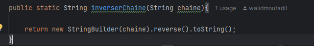

*Détails* :  
Elle utilise la classe StringBuilder pour inverser la chaîne, puis convertit le résultat en chaîne de caractères à l'aide de la méthode reverse().

**Fonction: nbMots(String chaine)**

*Description* : Cette fonction compte et retourne le nombre de mots dans la chaîne saisie.

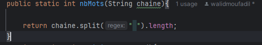

*Détails* :  
Elle utilise la méthode split(" ") pour diviser la chaîne en fonction des espaces, puis retourne la longueur du tableau obtenu, qui correspond au nombre de mots dans la chaîne.  
Fonction: saisieCaractere()  
Description : Cette fonction attend que l'utilisateur appuie sur une touche avant de revenir au menu principal.  
   
*Détails* :  
Elle utilise un Scanner pour attendre une entrée de l'utilisateur, assurant une pause avant de retourner au menu après une opération.

**Fonction principale: main(String\[\] args)**

*Description* : C'est la méthode principale qui exécute le programme et gère l'interaction avec l'utilisateur à travers un menu. Elle permet de naviguer entre différentes options et d'appeler les fonctions appropriées en fonction du choix de l'utilisateur.

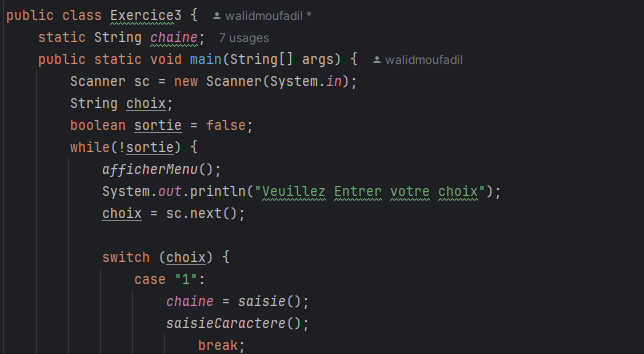  
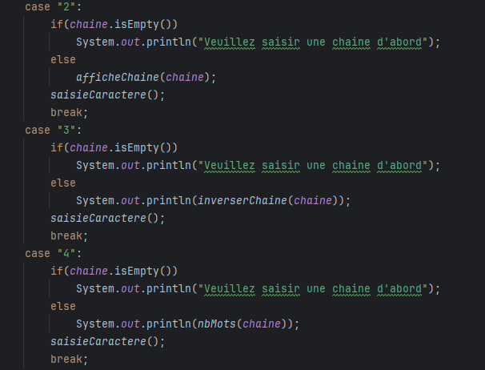  
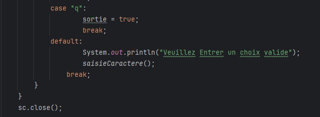

*Détails* :  
Le programme utilise une boucle while qui reste active tant que l'utilisateur n'a pas choisi de quitter en saisissant "q".  
Pour chaque option, une méthode correspondante est appelée pour exécuter l'opération sélectionnée (saisie, affichage, inversion, ou comptage de mots).  
Il gère également des messages d'erreur si l'utilisateur essaie d'utiliser une option sans avoir d'abord saisi une chaîne.

*Exécution* :

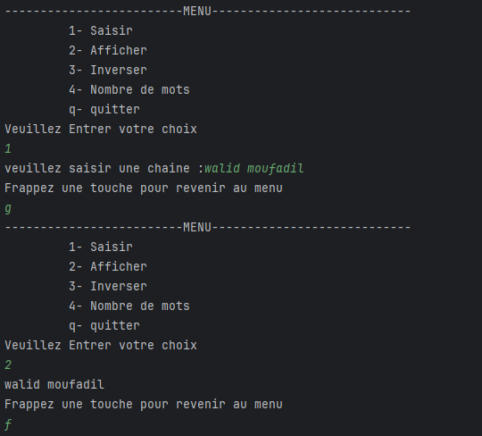  
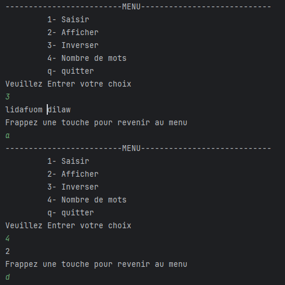

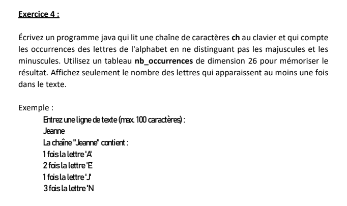  
*Introduction* :  
Ce programme a pour objectif de compter et d'afficher le nombre d'occurrences de chaque lettre de l'alphabet (minuscules) dans une chaîne de caractères saisie par l'utilisateur. Il est structuré de manière simple avec des fonctionnalités de saisie et de traitement de la chaîne, permettant à l'utilisateur de visualiser la fréquence des lettres dans le texte qu'il entre. Les principales étapes du programme sont :

*Saisie d'une chaîne de caractères* : L'utilisateur est invité à entrer une chaîne de texte.  
*Comptage des occurrences* : Le programme analyse la chaîne saisie et compte combien de fois chaque lettre de l'alphabet apparaît dans le texte.  
*Affichage des résultats* : Pour chaque lettre qui apparaît au moins une fois, le programme affiche le nombre d'occurrences.  
Ce programme est divisé en deux fonctions principales, qui sont orchestrées par la méthode main, garantissant un flux simple et compréhensible.

**Fonction: saisie()**

Description : Cette fonction permet de capturer la chaîne de caractères saisie par l'utilisateur.

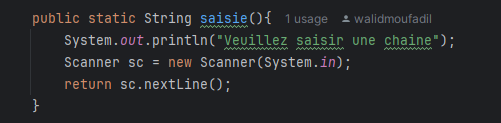

*Détails* :  
Elle affiche un message demandant à l'utilisateur de saisir une chaîne.  
Elle utilise un Scanner pour lire l'entrée de l'utilisateur depuis la console et retourne cette chaîne pour être traitée dans la suite du programme.

**Fonction nbOccurence(String chaine)**

*Description* : Cette fonction compte et affiche le nombre d'occurrences de chaque lettre de l'alphabet (minuscules) dans la chaîne saisie.

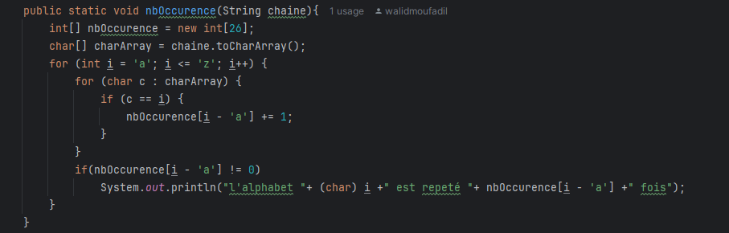

*Détails* :  
Un tableau nbOccurence de taille 26 (pour chaque lettre de l'alphabet) est utilisé pour stocker le nombre d'apparitions de chaque lettre.  
La chaîne est convertie en tableau de caractères (charArray) pour pouvoir être parcourue.  
Une double boucle est utilisée :  
La première boucle parcourt chaque lettre de l'alphabet (de 'a' à 'z').  
La deuxième boucle parcourt chaque caractère de la chaîne et compare si le caractère est égal à la lettre en cours dans la première boucle.  
Pour chaque lettre trouvée dans la chaîne, le programme incrémente le compteur correspondant dans le tableau nbOccurence.  
Si une lettre apparaît au moins une fois, le programme affiche le nombre d'occurrences de cette lettre.

**Fonction main(String\[\] args)**

Description : C'est la méthode principale du programme, qui orchestre l'exécution des différentes étapes.

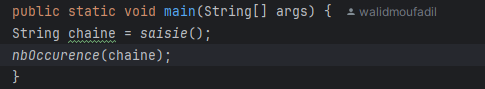

*Détails* :  
Elle appelle la fonction saisie() pour capturer la chaîne de caractères saisie par l'utilisateur.  
Elle passe cette chaîne à la fonction nbOccurence() pour compter et afficher le nombre d'occurrences de chaque lettre dans le texte.  
*Exécution* :  
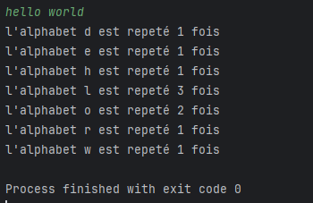
